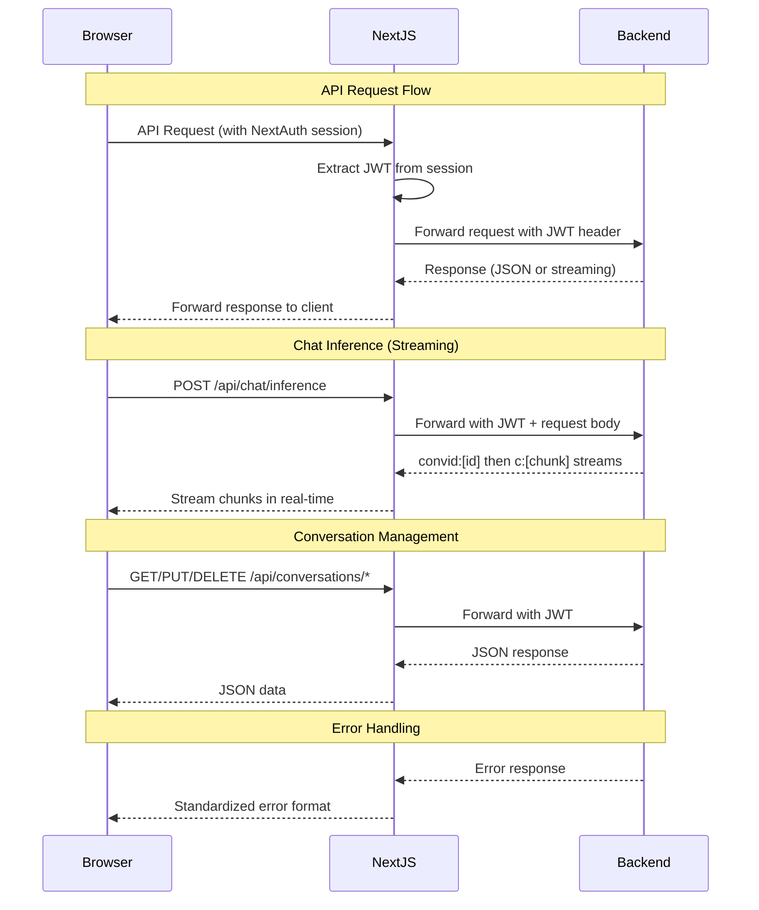

# Chatbot API Draft

## Overview

This document outlines the API endpoints for the Chatbot frontend application. The Next.js application acts as a proxy between the browser client and the custom inferencing backend.

### Architecture

```
Browser Client → Next.js API Routes → Custom Inferencing Backend
```

### API Lifecycle Diagram



### Authentication

All API requests include JWT authentication via `Authorization: Bearer <token>` header when a user session exists. The JWT is obtained from NextAuth session.

## Endpoints

### 1. Chat Inference

**Endpoint:** `POST /api/chat/inference`

**Purpose:** Perform chat inference with optional conversation context. Supports streaming responses.

**Request Body:**
```json
{
  "conversation_id": "string (optional)",
  "message": "string (required)"
}
```

**Response:** Streaming response with encoded format
- Always sends `convid:[conversationId]` first (whether new or existing conversation)
- Then sends streaming chunks as `c:[chunktext]`
- Format: Server-Sent Events or plain text stream with prefixed messages

**Backend Proxy:** Forwards to custom backend's chat inference endpoint.

---

### 2. Pin Conversation

**Endpoint:** `PUT /api/conversations/[id]/pin`

**Purpose:** Toggle the pinned status of a conversation.

**Request Body:** None (toggle operation)

**Response:**
```json
{
  "id": "string",
  "isPinned": "boolean"
}
```

**Backend Proxy:** Updates conversation pin status in backend.

---

### 3. Delete Conversation

**Endpoint:** `DELETE /api/conversations/[id]`

**Purpose:** Delete a conversation and all associated chat history.

**Request Body:** None

**Response:**
```json
{
  "success": true,
  "message": "Conversation deleted successfully"
}
```

**Backend Proxy:** Deletes conversation from backend.

---

### 4. Get Conversation History (Navbar)

**Endpoint:** `GET /api/conversations`

**Purpose:** Retrieve list of conversations for the navbar sidebar.

**Query Parameters:** None

**Response:**
```json
[
  {
    "id": "string",
    "title": "string",
    "createdAt": "number (epoch milliseconds)",
    "isPinned": "boolean"
  }
]
```

**Backend Proxy:** Fetches conversation list from backend.

---

### 5. Get Chat History

**Endpoint:** `GET /api/conversations/[id]/chats`

**Purpose:** Retrieve chat history for a specific conversation with pagination support.

**Query Parameters:**
- `last_timestamp` (optional): Epoch timestamp (number). If not provided, returns latest chats.
- `limit` (optional): Number of chat bubbles to return. Default: 50.

**Response:**
```json
[
  {
    "id": "string",
    "conversation_id": "string",
    "role": "user|assistant",
    "content": "string",
    "timestamp": "number (epoch milliseconds)"
  }
]
```

**Backend Proxy:** Fetches paginated chat history from backend.

## Axios Client

### Configuration

- Base URL: Configurable via environment variable
- Automatic JWT header injection when session exists
- Error handling for authentication failures
- Support for streaming responses

### Usage Example

```typescript
import { apiClient } from '@/lib/api-client'

// Chat inference with streaming
const response = await apiClient.post('/chat/inference', {
  conversation_id: 'conv-123',
  message: 'Hello'
}, {
  responseType: 'stream'
})

// Get conversations
const conversations = await apiClient.get('/conversations')

// Pin conversation
const updated = await apiClient.put('/conversations/conv-123/pin')
```

## Error Handling

All endpoints return standardized error responses:

```json
{
  "error": "Error message",
  "code": "ERROR_CODE"
}
```

Common error codes:
- `UNAUTHORIZED`: Missing or invalid JWT
- `NOT_FOUND`: Resource not found
- `VALIDATION_ERROR`: Invalid request data
- `BACKEND_ERROR`: Error from custom backend

## Environment Variables

- `NEXT_PUBLIC_BACKEND_URL`: URL of the custom inferencing backend
- `NEXTAUTH_SECRET`: NextAuth secret (existing)
- `NEXTAUTH_URL`: NextAuth URL (existing)

## Implementation Notes

1. All API routes in Next.js will validate JWT and proxy requests to backend
2. Streaming responses for chat inference will be handled via Server-Sent Events or similar
3. ChatContext will be updated to use these APIs instead of mock data
4. Error states and loading indicators will be added to UI components
5. Rate limiting and caching may be added based on backend capabilities